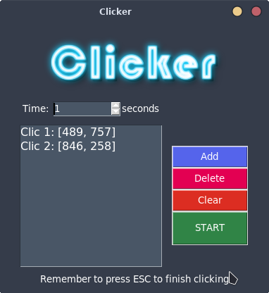

# Clicker

Clicker es una aplicacion hecha originalmente para ganar tiempo en las matriculas univeristarias, ya que, debido a la poca apertura de cupos para las asignaturas, a veces no era posible inscribirse en algunas materias.

## Requisitos para usar clicker

Tener python 3.6 y ejecutar lo siguiente en la consola:
~~~
pip install -r requirements.txt
~~~

## Ejecutar Clicker

Para ello solo ejecutaremos el archivo *clicker_aplication.py*

una ves ejecutado veremos la siguiente ventana:

